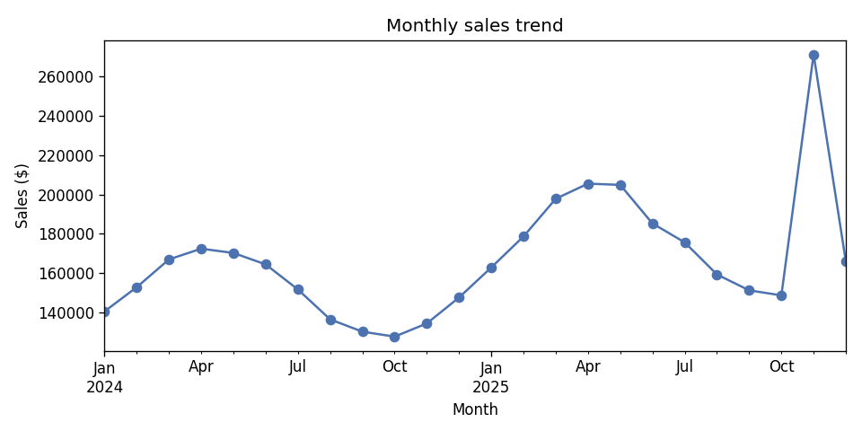
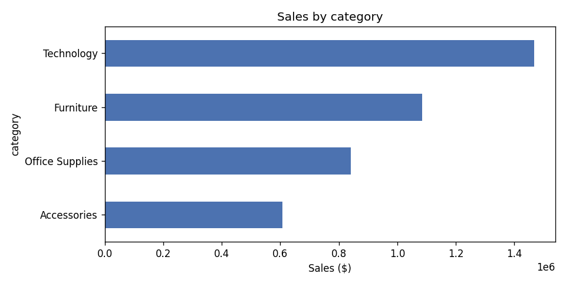
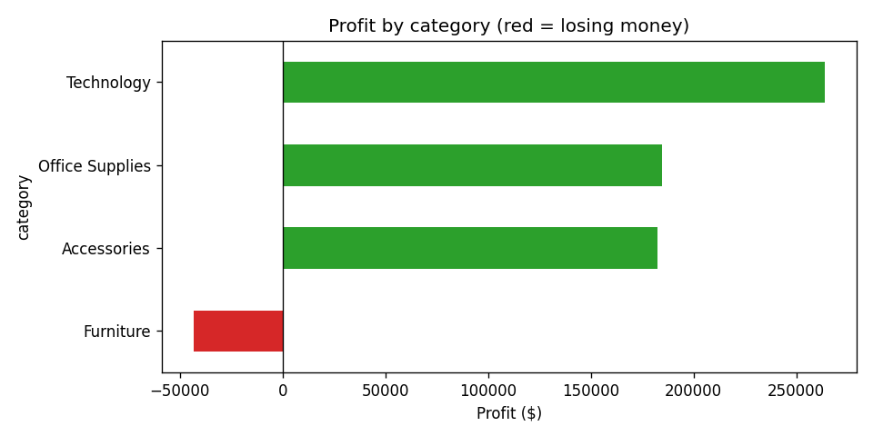

# 📈 Automated Sales Report

*Auto-generated from 384 records · period: Jan 2024 - Dec 2025.*

## Executive summary

Across 24 months (Jan 2024-Dec 2025), total sales were $4,000,381 at a 14.7% profit margin ($587,812 profit). In the latest month (Dec 2025) sales were $165,807, down 38.9% versus the prior month. West was the top region and Technology the top category by sales. Loss-making categories to investigate: Furniture ($-43,418). Nov 2025 stands out as an outlier ($271,365, z=3.3) and is worth a closer look.

## Key numbers
- **Total sales:** $4,000,381
- **Total profit:** $587,812
- **Profit margin:** 14.7%
- **Top region:** West
- **Top category (sales):** Technology

## Charts

### Monthly sales trend

### Sales by category

### Profit by category

