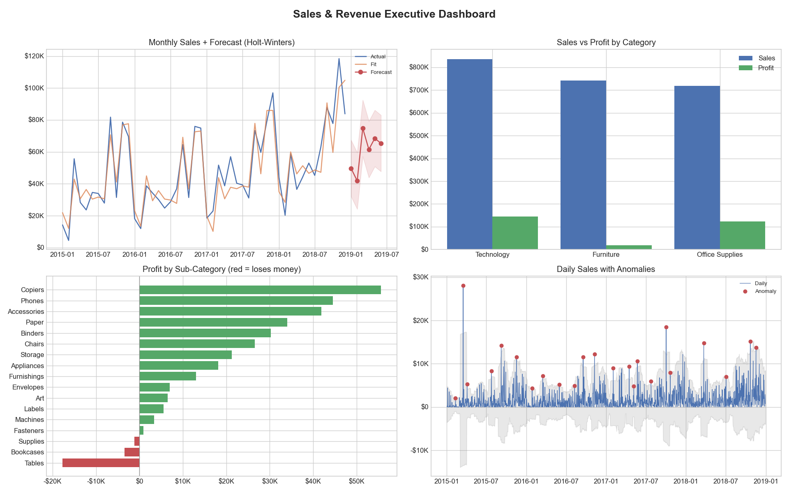
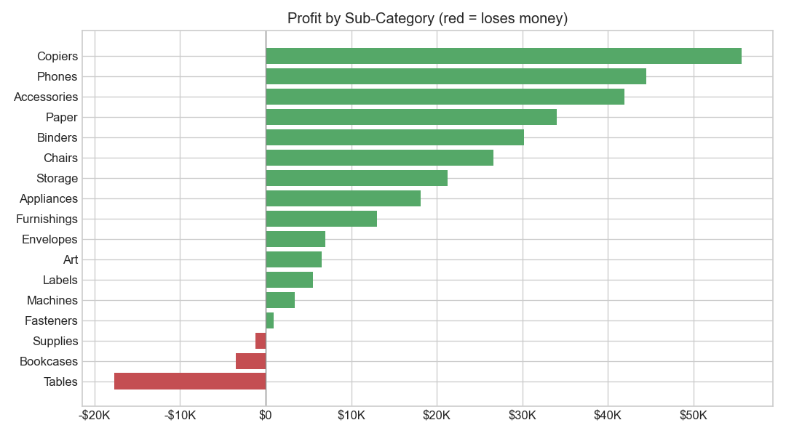
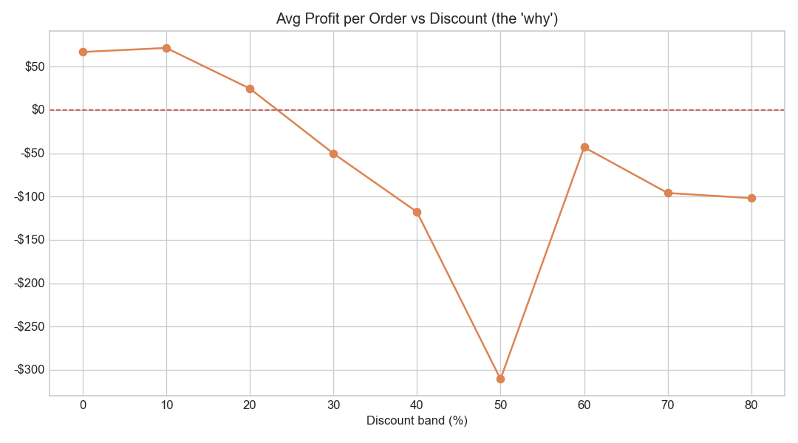
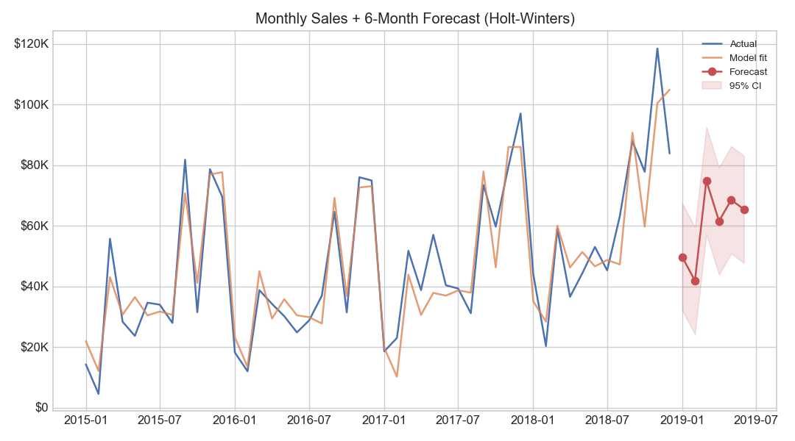
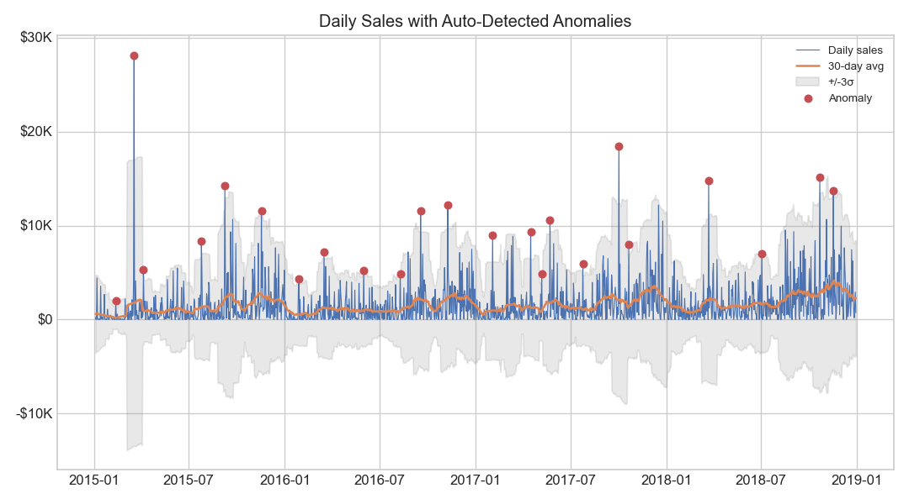

# 📊 Sales & Revenue Intelligence Dashboard

> A company-grade sales analytics pipeline on the real **Sample - Superstore**
> dataset. It doesn't just show *what happened* — it explains **why**, predicts
> **what's next**, flags **what's wrong**, and tells the business **what to do**.




---

## 🎯 Why this project exists

Most "sales dashboard" portfolio projects are the same: a few bar charts of total
revenue and top products. They look fine — but they have **three fatal gaps** that
any hiring manager will spot in seconds:

1. They only show **what happened** — no forecast, no *why*, no action.
2. They celebrate **vanity metrics** (total sales) and miss that some bestsellers
   actually **lose money**.
3. They assume **perfectly clean data** and break the moment real data has nulls,
   duplicates or bad types.

**This project rebuilds the sales dashboard the way a real company would** — on the
real Superstore dataset — and fixes every one of those gaps. The point is to
demonstrate the rarest analyst skill: **critical thinking** — *"here's what's wrong
with the standard approach, and here's how I fixed it."*

---

## 🆚 The standard project vs. this one

| Limitation of the typical dashboard | ✅ How this project fixes it | Skill shown |
|---|---|---|
| Only descriptive ("what happened") | **Back-tested forecast** — 3 models compared out-of-sample | Predictive analytics |
| No explanation of *why* | **Discount → profit** analysis explains the margin story | Root-cause analysis |
| Vanity metric: total sales | **Profit & margin** view exposes **loss-making bestsellers** | Business judgement |
| Silent on sudden changes | **Automatic anomaly detection** flags abnormal days | Monitoring / stats |
| Breaks on messy data | **Auditable cleaning pipeline** drops 806 junk rows from the raw file | Data engineering |
| Ends at a chart | Every insight ends in a **quantified recommendation** | Communication |

---

## 🔑 Headline findings (from the live run on real data)

- 💰 **Total sales \$2.30M, profit \$286K, overall margin 12.5%.**
- 🚨 **Tables and Bookcases are *loss-making bestsellers*.** They rank among the
  highest-revenue sub-categories yet **lose \$17,725 and \$3,473** (margins of
  **−8.6%** and **−3.0%**) — entirely because of deep discounting. *This is the
  single most famous real-world insight in this dataset, and a naive "top products"
  chart hides it completely.*
- 📈 **Technology carries the business** — \$145K profit at a **17.4% margin**, the
  healthiest of the three categories (Furniture is barely profitable).
- 🔮 **Next 6 months projected at \$362K** by a **back-tested** Holt-Winters model
  (chosen over SARIMAX and log-HW by out-of-sample accuracy — 15.6% MAPE).
- 🔎 **23 anomaly days auto-detected** across 2015–2018 for the team to investigate.

---

## 🛠️ The five fixes, in detail

Each fix lives in its own function in [`src/pipeline.py`](src/pipeline.py).

### FIX #3 — Robust data cleaning *(real data is messy)*
The public Superstore mirror ships **deliberately dirty**: 806 completely blank rows
(plus null postal codes and inconsistent text). A naive `read_csv()` → `sum()` would
silently mis-report totals. The cleaner is **schema-aware** (it adapts whether or not
a `unit_price` column exists) and **logs every fix** so the work is auditable:

```python
df["order_date"] = pd.to_datetime(df["order_date"], errors="coerce")  # blanks -> NaT
df = df[df["order_date"].notna()]                                      # drop blank rows
df = df.drop_duplicates()
for col in ("region", "category", "sub_category"):                    # "WEST"->"West"
    df[col] = df[col].astype(str).str.strip().str.title()
```

**Result — auditable cleaning report:**
```
rows_loaded                    : 10,800
invalid_or_blank_dates_dropped : 806      <- the junk rows the mirror injected
duplicates_removed             : 0
rows_clean                     : 9,994    (92.5% retained = the canonical Superstore count)
```
> **Why it's better:** the typical dashboard would ingest 806 blank rows and report
> wrong totals. This one removes exactly the junk, keeps the real 9,994 transactions,
> and *proves* what it did.

---

### FIX #2 — Profit & margin, not vanity revenue *(the headline)*
Revenue ranks Tables and Bookcases as stars. **Profit tells the truth:**



```python
hi_rev = by_sub["sales"] >= by_sub["sales"].median()
loss_makers = by_sub[hi_rev & (by_sub["profit"] < 0)].sort_values("profit")
```

| sub_category | sales | profit | margin |
|---|--:|--:|--:|
| Tables | \$206,966 | **−\$17,725** | −8.6% |
| Bookcases | \$114,880 | **−\$3,473** | −3.0% |

The *why* is deep discounting — average profit per order collapses as discount rises:



> **Why it's better:** it surfaces a five-figure problem that a revenue-only
> dashboard hides completely.

---

### FIX #1a — Forecast the future *(back-tested model selection)*
A backward-looking chart can't help you plan. And reporting a model's *in-sample*
error flatters it — it's graded on data it already saw. So instead I **hold out the
last 6 months**, forecast them blind, and pick the winner by true *out-of-sample*
accuracy (see [`src/forecasting.py`](src/forecasting.py)):

```python
backtest(monthly, horizon=6)   # Holt-Winters vs Holt-Winters(log) vs SARIMAX
```

| model | out-of-sample MAPE |
|---|--:|
| **Holt-Winters** ✅ | **15.6%** |
| SARIMAX(1,1,1)(1,1,1,12) | 17.4% |
| Holt-Winters (log) | 21.3% |



> **Why it's better:** reporting *back-tested* accuracy (not in-sample) is what
> separates a rigorous forecast from a misleading one. The winning model projects
> **\$362K** over the next 6 months and captures the strong Q4 peak.

---

### FIX #1b — Automatic anomaly detection *(catch problems early)*
Instead of eyeballing the chart, the pipeline flags any day outside a rolling
**mean ± 3σ** band — catching stock-outs, pricing bugs, or one-off bulk orders:

```python
roll = daily.rolling(window=30, center=True)
upper, lower = roll.mean() + 3*roll.std(), roll.mean() - 3*roll.std()
anomalies = daily[(daily > upper) | (daily < lower)]
```



> **Why it's better:** monitoring is automated and objective, not a human squinting at
> a line chart. It flagged **23 unusual days** for review.

---

### FIX #1c — Every insight ends in an action
Numbers don't pay the bills — decisions do. The pipeline auto-writes recommendations
tied to the figures it found, e.g.:

> **CAP DISCOUNTS** on loss-making bestsellers (Tables, Bookcases). *Tables* sells well
> but **loses \$17,725** (margin −8.6%). Capping discount near break-even turns these
> from a drain into profit.

See the full auto-generated [`outputs/insights_report.md`](outputs/insights_report.md).

---

## 🧱 Tech stack
- **Python** · **pandas / numpy** (data wrangling) · **matplotlib** (visualisation)
- **statsmodels** (Holt-Winters time-series forecasting)
- Clean, modular, documented code — one function per responsibility.

## 📁 Project structure
```
sales-revenue-dashboard/
├── main.py                   # runs the pipeline on the REAL Superstore data
├── main_synthetic.py         # bonus: stress-tests cleaning on broken synthetic data
├── build_notebook.py         # assembles + executes the analysis notebook
├── requirements.txt
├── notebooks/
│   └── 01_sales_analysis.ipynb   # narrative walkthrough (pre-rendered, view on GitHub)
├── src/
│   ├── superstore_loader.py  # auto-downloads the real Sample-Superstore CSV
│   ├── data_generator.py     # builds synthetic data + injects quality issues
│   ├── forecasting.py        # back-tested model selection (HW / log-HW / SARIMAX)
│   └── pipeline.py           # clean / profit / forecast / anomaly / recommend
└── outputs/                  # real-data charts + insights_report.md (committed)
```

## ▶️ How to run
```bash
pip install -r requirements.txt
python main.py                # real Superstore data (auto-downloads on first run)
```
Outputs (charts + report) are written to `outputs/`. Runs in seconds.

**Bonus — cleaning stress test:**
```bash
python main_synthetic.py      # same pipeline on deliberately-broken data -> outputs_synthetic/
```
This proves the cleaner handles nulls, duplicates, negative quantities and fat-finger
prices that the (already-clean) real data doesn't contain.

**📓 The notebook** — [`notebooks/01_sales_analysis.ipynb`](notebooks/01_sales_analysis.ipynb)
is a narrative walkthrough with live tables and inline charts. It renders directly on
GitHub (pre-executed). To run it yourself: `pip install jupyter` then `jupyter lab`.

---

## ⚖️ Limitations & future work *(honesty matters)*
No analysis is perfect — naming the gaps is part of the job:

- **Forecast is univariate.** It models sales over time only. I already added
  **walk-forward back-testing** and compared Holt-Winters / log-HW / SARIMAX; the next
  step is a **SARIMAX with exogenous drivers** (promotions, holidays) to push below the
  current 15.6% out-of-sample MAPE.
- **Anomaly detection is statistical, not causal.** It flags *that* a day is unusual,
  not *why* — the recommendation is to investigate, not auto-conclude.
- **Centered rolling window** is used for clean visuals; a production monitor would use
  a **trailing** window so it can alert in real time.
- **Profit is taken as given** in the source data; a margin-bridge analysis would break
  it into price, cost and discount effects.

## 🧠 Skills demonstrated
Real-world data cleaning & validation · profitability/margin analysis · time-series
forecasting · anomaly detection · turning analysis into business recommendations ·
reproducible, documented, modular Python.

## 📚 Data
*Sample - Superstore* — a widely used retail dataset (originally a Tableau sample),
auto-downloaded from a public [GitHub mirror](https://github.com/leonism/sample-superstore).
~9,994 transactions across 2015–2018, 3 categories and 17 sub-categories.

---

*Built to show the difference between a chart-maker and an analyst: not just plotting
data, but cleaning it, questioning it, predicting it, and acting on it.*
